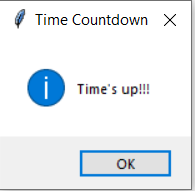

# Python-CountDown-Timer

# Approach used:-
 

1) Importing the module – tkinter, time
2) Create the main window (container)
3) Add number of widgets to the main window:Button, Entry
4) Apply the event Trigger on the widgets.

# Interface

